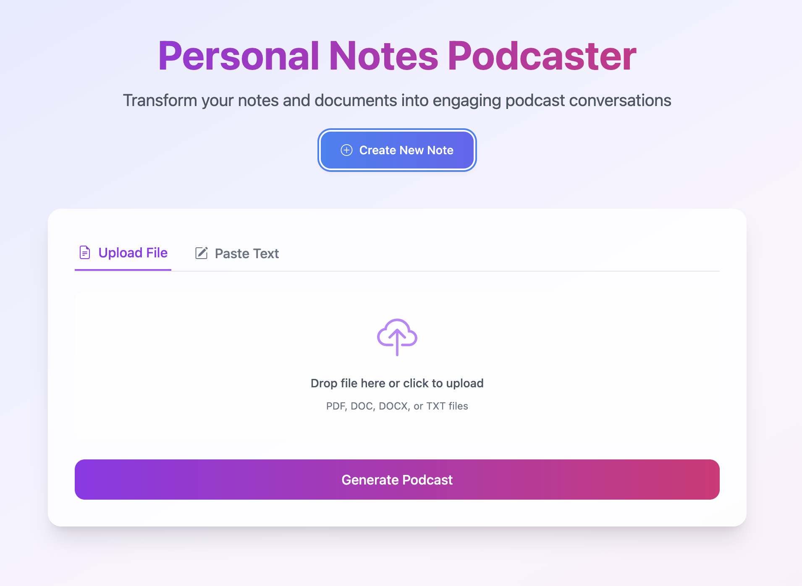

# Notes to Podcast

Convert your text documents, notes, or articles into engaging podcast-style conversations. This application uses AI to transform written content into natural-sounding discussions between a host and a guest, complete with audio output and AI-generated summaries.

> This project was developed considering article, notes will be technical in nature. The AI model used for text generation is trained on technical content and may not work well with other types of content. Feel free to updaete the model or prompt for better results.



## Features

- 📝 Support for multiple input formats (PDF, DOC, DOCX, TXT)
- 🎙️ Converts text into natural dialogue
- 🗣️ Text-to-speech with different voices for host and guest
- 📊 AI-generated content summary
- 🎧 Downloadable MP3 podcast output
- 💬 Direct text input support
- 🎨 Modern, responsive UI

## Prerequisites

- Node.js (v18 or higher)
- FFmpeg
- Ollama (for AI text generation)

### Installing Prerequisites

#### FFmpeg Installation
```bash
# macOS
brew install ffmpeg

# Ubuntu/Debian
sudo apt-get update && sudo apt-get install ffmpeg

# Windows (using chocolatey)
choco install ffmpeg
```

#### Ollama Installation
```bash
# Install Ollama
curl -fsSL https://ollama.com/install.sh | sh

# Start Ollama service
ollama serve

# Pull required model
ollama pull mistral
```

## Installation

1. **Clone the Repository**
```bash
git clone https://github.com/hemangmehta/notes-to-podcast.git
cd notes-to-podcast
```

2. **Install Dependencies**
```bash
npm install
```

3. **Create Required Directories**
```bash
mkdir -p uploads output
```

4. **Start the Server**
```bash
# Development mode
npm run dev

# Production mode
npm start
```

6. **Access the Application**
- Open your browser
- Navigate to `http://localhost:3000`

## Configuration

The application can be configured through environment variables or the config files in `src/config/`:

```javascript
// src/config/app.js
export default {
    port: process.env.PORT || 3000,
    environment: process.env.NODE_ENV || 'development',
    
    paths: {
        uploads: 'uploads',
        output: 'output',
        temp: 'temp'
    },
    
    ai: {
        model: 'mistral',
        endpoint: 'http://localhost:11434',
        options: {
            temperature: 0.7,
            top_p: 0.9,
            num_predict: 2048
        }
    }
    // ... other configurations
};
```

## Contributing

1. Fork the repository
2. Create your feature branch (`git checkout -b feature/<feature-name>`)
3. Commit your changes (`git commit -m '<feature description>'`)
4. Push to the branch (`git push origin feature/<feature-name>`)
5. Open a Pull Request

## Known Issues
- Large files may take longer to process
- Some complex formatting in PDFs might be lost
- Audio generation might have occasional pauses

## License
This project is licensed under the MIT License - see the [LICENSE](LICENSE) file for details.

## Support
For support:
1. Check the [issues](https://github.com/hemangmehta/notes-to-podcast/issues) page
2. Create a new issue with:
   - Detailed description of the problem
   - Steps to reproduce
   - System information

## Future Enhancements
- [ ] Improve voice modulation, tone, and pacing
- [ ] Add support for more input formats
- [ ] Enhance AI model for better text generation
- [ ] Add support for custom AI models